# Death Star Automation 2026

Verson 0.1.1 (very rough draft, for legal documentation)

The carrier commonly known for their 'Death Star' like logo, seemingly has unstoppable, uncorrectable Automation (including AI auto-closing tickets, admittedly so by their own reps).  It is wholly incapable of any accountability even across billing cycles.  The **root cause** is crystal clear ... their **carrier services end, including sending notifications** when their [International Day Pass (IDP)](https://www.att.com/international/day-pass/) is enabled, is **not 'in-sync' with their billing services end, which will still charge around $2,000 per GB** for international roaming.  Here is our personal example, for which we're still 'on-the-hook' for $22,000 of completely unjustified charges.

## Executive Summary

We have been charged over $20,000 for international roaming (was $32,000 at one point, with late fees, despite extensions), when we were on the [International Day Pass (IDP)](https://www.att.com/international/day-pass/) before we even left, and were confirmed to have been via text messages from the very start upon landing.  After 20+ hours of calls (not including dozens of other efforts), 100% admissions of fault by their own billing department on every, single call we made, including the fact that it will be voided soon, every ticket is closed, every review canceled, every attempt at accountability nillified, within 24 hours, and we 'start again' with every, 1-2 hour call.

To be complete, but succint, here is the summary, in bullets.

 - Phones: 4, 2 each, US Moto site-purchased (unlocked) phones, used 2 w/EE SIM, other 2 w/AT&T SIMs
 - Thu-Fri 5/7-8: Verified by call both our AT&T SIM phones would be on the International Day Pass (IDP) 5/11-29
 - Tue 5/11: Both AT&T SIM phones receive text messages verifying IDP, $12/day, on taxiway at EDI (Scotland)
 - Tue 5/26: I receive text message verifying IDP, $12/day, on taxiway at FRA (Germany), my short layover
 - Tue 6/9: Wife informs me AT&T will debit $22,200.66 from checking, we both call, charged international roaming
 - My wife hits brick wall, but my rep opens a ticket, says roaming will be voided, I receive a text confirmation
 - 7-day payment extension granted, to Tue 6/16, void needs up to 5 business days to process
 - I visit our bank, given amount, our bank does not credit that day, they agree to block AT&T transfer
 - Mon 6/15: Wife calls, verifies Tue 6/9 ticket was auto-closed Wed 6/10, billing states IDP only enabled Fri 5/29
 - Extension to Tue 6/30 is granted, but says it requires my wife to agreed to a payment plan for an extension
 - Tue 6/16-17: Wife calls over 36 hours, ticket from 6/15 is now closed, no change, several reps blame AI
 - Tue 6/23: After repeat attempts to change payment to credit card over 10 days, we close bank account
 - Fri 6/26: Bill is now $32,408.31, due 7/11, additional roaming and even late fees, despite extensions to 6/30
 - I call, once again they are powerless, despite confirming our IDP was set to be enabled by 5/11
 - Transferred to Customer Loyalty, disconnected after 2 total hours, calls back, puts in for a reversal
 - Sat 6/27: Pay $600 one-time with AmEx to cover 2 months of normal charges + IDP for each month
 - Reversal of just the additional roaming and late fees ($9,922.62), but $22,485.69 total is still due

Payment of $22,200.66 will still be attempted on Tue 6/30 (tomorrow, as I write this), under threat of disabling our numbers.  We are out of options.  Hopefully public disclosure will prevent our phones from being turned off.

## Playing It Safe:  International Day Pass (IDP)

I was with another provider for 20 years (2005-2025), but after we moved to AT&T fiber for home Internet in spring of 2025, they visited my wife at home.  She received an educational discount, and even on the premier, top level plan, unlimited, it was nearly $50 cheaper than our current plan before even bundling was considered.  We transferred our numbers that day, with SIMs provided by the representatives.

A year later, when we were set to travel to Scotland for a conference, I decided to get EE SIMs for our US Moto-site purchased (unlocked, full retain, all networks) 'backup' phones.  I always buy US retail, unlocked phones by Motorola or Samsung for the best band coverage, either from Amazon, Best Buy or increasingly, just the US Moto site itself, including Moto Care for my wife's phone (she tends to get the upper mid-range models).  The foreign Moto and Samsung models are often carrier unlocked and have more limited bands any way, and same with even new, but foreign models, so I always get the exact model numbers for US models, but Moto's US site has pretty much made that unnecessary step now (but I still check after receiving it).

When going to Europe, and in the past when with another provider, I normlaly get French Orange SIMs with a pre-paid plan.  But everyone stated EE ws better for the United Kingdom.  Furthermore, I looked up AT&T's rates, which were an astonishing $2.05 per MB (over $2,000 per GB!), I discovered [AT&T's International Day Pass (IDP)](https://www.att.com/international/day-pass/).  It used our existing plan, for $12/day, +$6/day for each line on the same account (so $18/day for both of us), up to 10 days per billing cycle (maximum $180/day).

That would less money than just 90MB of data, so totally worth it, and we 'played it safe.'  When my wife called a number of times, between Thursday and Friday, May 7th and 8th, the first rep said we were already on it, being premier, unlmited customers.  She called again, and gave them the exact days, and they said it would be enabled.  That last call was to verify it would cover us leaving Sunday, May 10th -- red eye -- landing at EDI in Scotland on Monday, May 11th.

Carlos (the AT&T rep) said it would be enabled from then, until Friday, May 29th when she left, as I was leavingt earlier.  She even received a survy regarding the that call mid Friday morning.

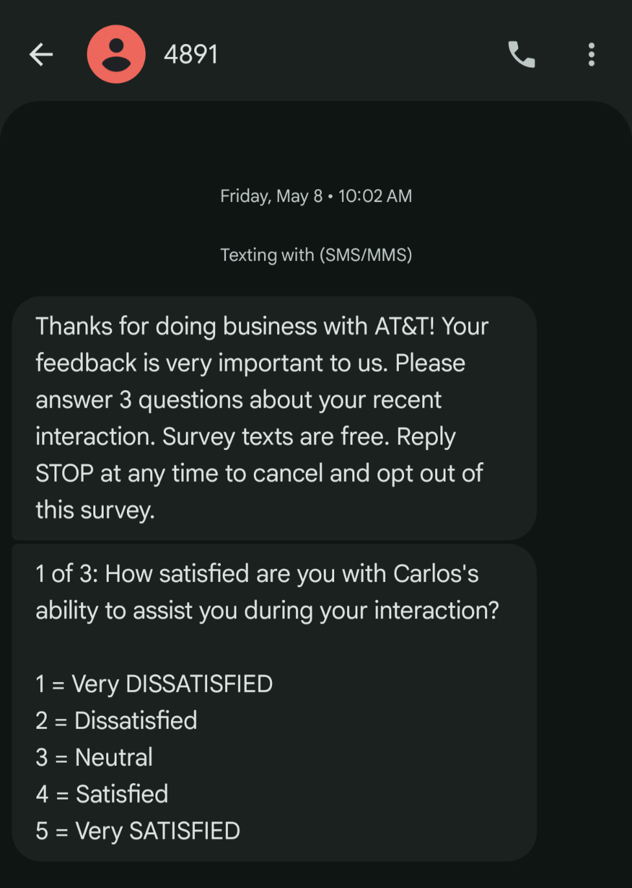

I also verified it would apply to Germany as well, as I had a layover in Germany on Tuesday, May 26th, as I was coming back sooner, and saw it enabled on my phone too, on-line.  I wanted to literally triple-check myself, not because I didn't trust my wife, but because ... well, you know how these things go.  It was enabled when I looked it up before leaving (I didn't not take a screenshot).

## Confirmed via Text Alerts:  International Day Pass

When we landed in Scotland on the morning of Monday, May 11th, we both received text messages.  We were on AT&T's best plan, the IDP, as you can read for yourself.

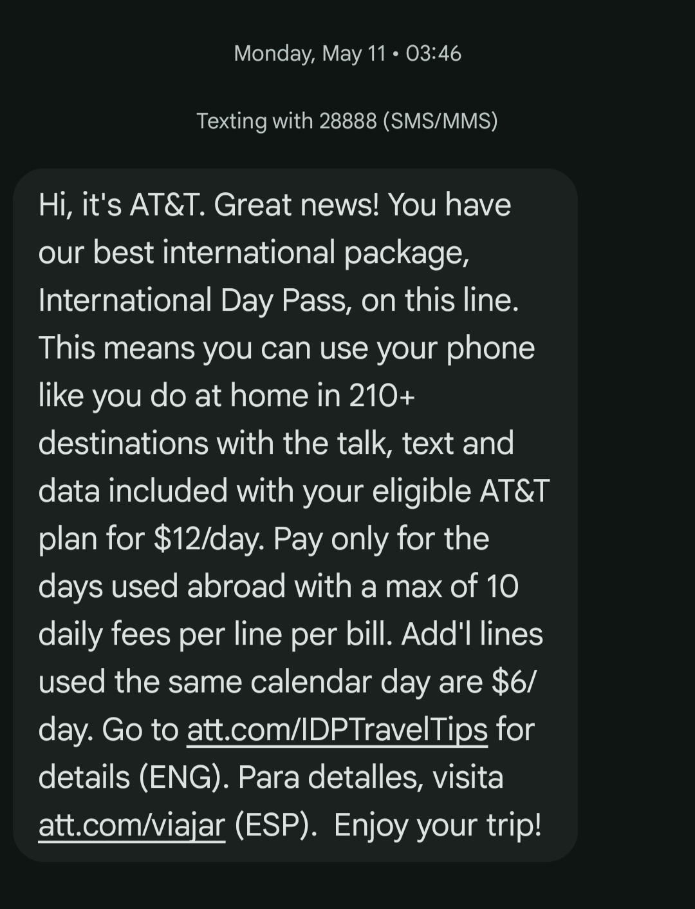 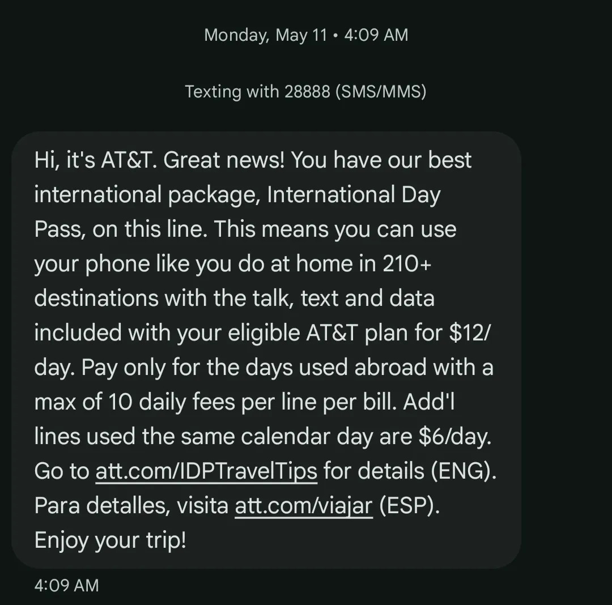

I would further receive notifications on Sunday, May 24th, exactly 2 weeks after we arrived, and again on Tuesday, May 26th, when I landed in Germany for my layover on my return home.

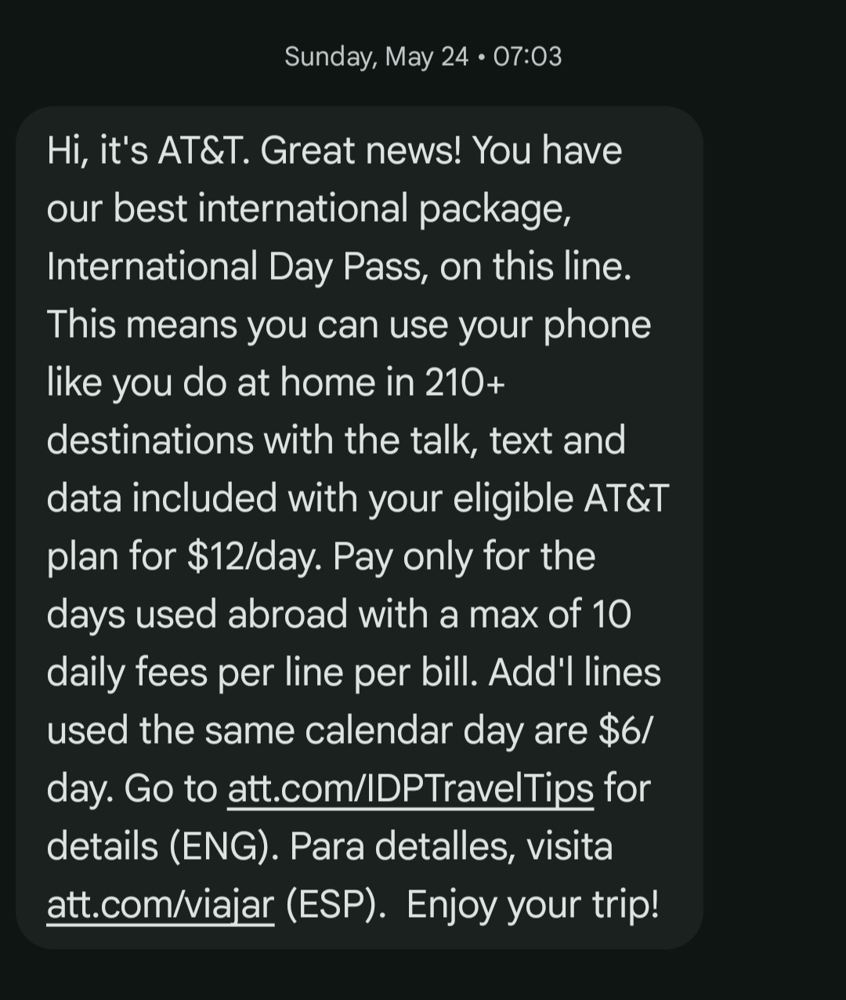 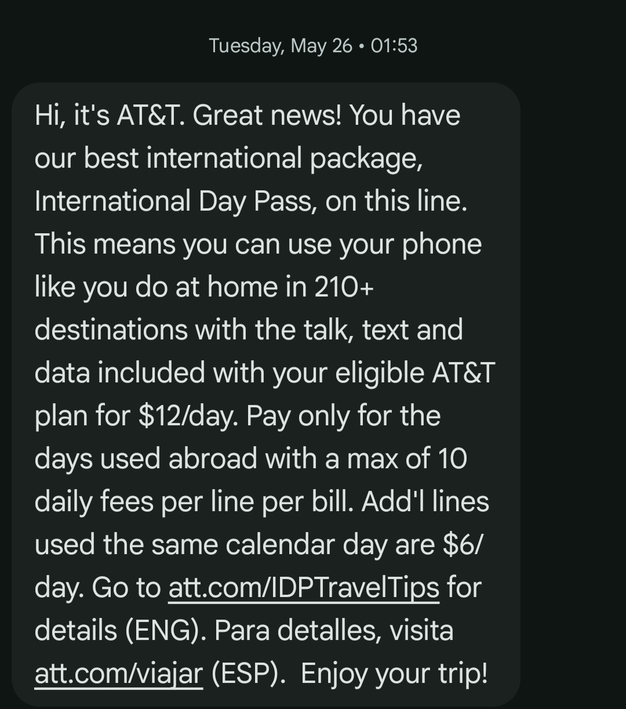

My wife had a direct flight back to the US on Friday, May 29th.

We never went on a cruise.  We never got on a boat in the ocean.  A little Lockness boat was as far as I ever did, and only for a couple hours.  And were always on land, cell towers connected to land at all time, no satellite uuplinks.  I verified that on my phone several times (did not take any screenshots).

## The Payment Notification:  $22,200.66

I work in areas where I cannot be reached.  My wife was able to get a message to me that it was an emergency on Tuesday, June 9th.  This is what she received.

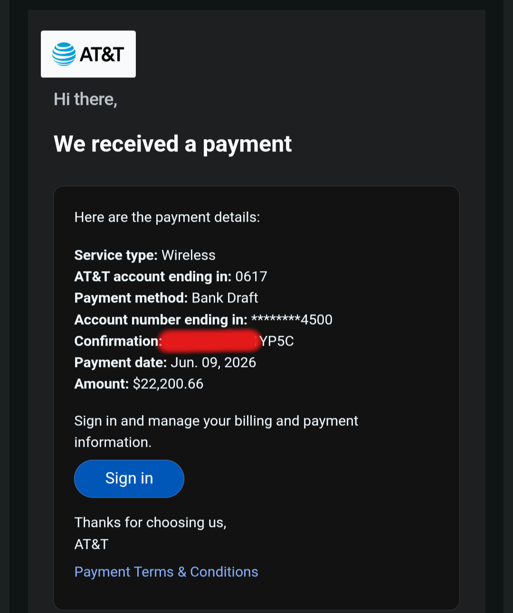

Coincidentally, we had enough in the bank account, because we were preparing to make a downpayment on a house.  So we both immediately called.  My wife hit a 'roadblock' from the get-go.  She even had 'representatives' unable to understand it was not $200, but over $22,200, showcasing their issues with English digits and orders of magnitude.  In my case, I had my shortest call during this fiasco, 55 minutes, after initially being disconnected at one point.

## Barely an Hour:  Joshua Opens Ticket to Void

I spoke to Josh[ua] (ID JI466Q) in their billing department who spoke near perfect English, even though their customer service was outsourced.  I even made a joke to start, something about me 'letting his eyeballs pop out.'  I was largely just jolly and kinda 'amuzed.'  He took the situation very seriously, was very professional, and appreciated my understanding too.  He was just trying to do his job.  He did confirm it should have been enabled, and he recognized we did receive those notifications that we were on IDP on May 11th, as it was noted as such in our account too ... both phones, my wife being the primary.

I would received the following text messages, the first one while Josh was on the call, and the second one after, confirming the charge would be voided.

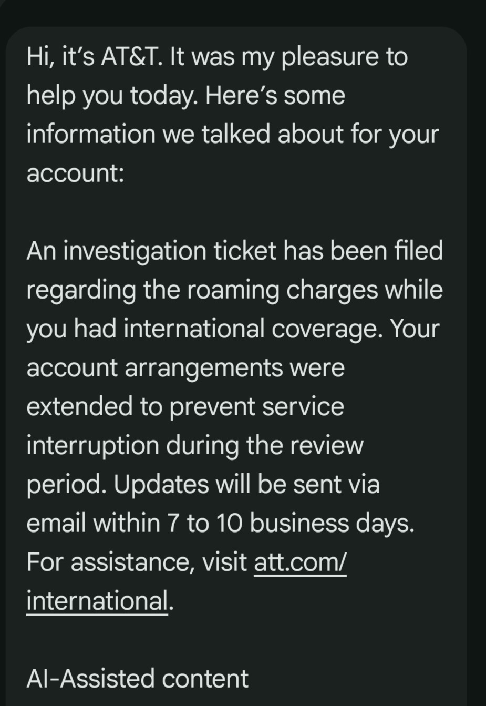 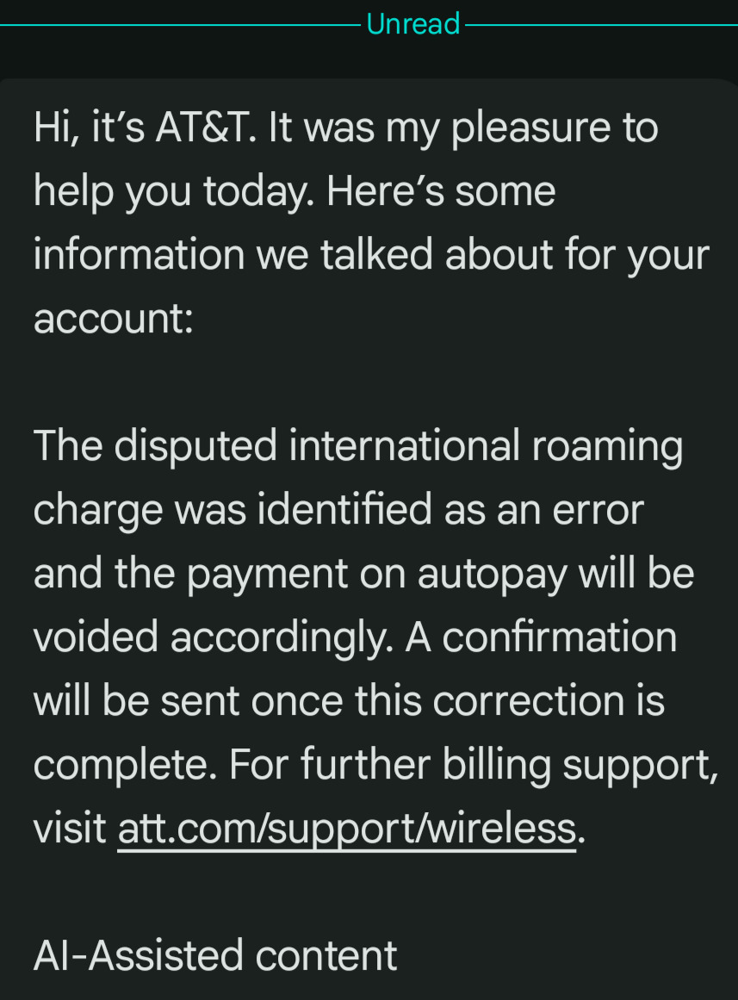

He said it should be addressed in one (1) business day, but he was going to extend our payment another week, until Tuesday, May 16th, as it could take up to five (5) business days to void.

I thought it was the end of it.  But still, already killing my day at work, where I have to be on-site without communication, I decided to visit the bank.  It was a bank I worked for nearly a half-decade, first as a vendor, and then after doing 9 months elsewhere (I respect Non-Compete clauses, and my employer I worked for nearly a decade, 7 as a direct, full time employee, placed me there), I came on as a direct employee.

Gerardo took care of me, and was very interested in my text messages.  They put a block on AT&T, but did say I may need to close the account, since AT&T could try different methods to bill it.  My wife had previously attempted to transfer funds into our savings (different account, same bank), of which the bank had put a general hold on various transactions (even account to account), but our transfer was eventually allowed to go through.

We attempted on-line to change our payment method, but other than paying in full, that was not an option, just like on the phone.  We waited and kept checking the rest of the week.

## No Change by Next Week:  AI Gone Wild

After checking on-line that the balance was still outstanding throughout the week, and again the following Monday, June 15th, she called again.  She spoke to Janice and esclated to James (ID JU005M).  The ticket Joshua had created, was closed by Wednesday, June 10th, no change.  This is when my wife first confirmed the IDP was only enabled starting Friday, May 29th.

After much discussion, they too agreed she had called to confirm late in the week before we even left, and it had been enabled.  They saw the notes from May 8th, and clearly it was push to their carrier services, which is why we both received the text messages on the 11th.  But the billing system was still treating it as only enabled as of May 29th.  At this point, my wife was growing frustrated, and it would only get worse.

Another ticket was opened, and this time, we got the number, Case number 0004783634.  My wife made countless more calls Tuesday, May 16th, and Wednesday, May 17th.  This isn't even a complete log, but the typical 'phone tag' she was playing with AT&T, not including 611 and later calls.

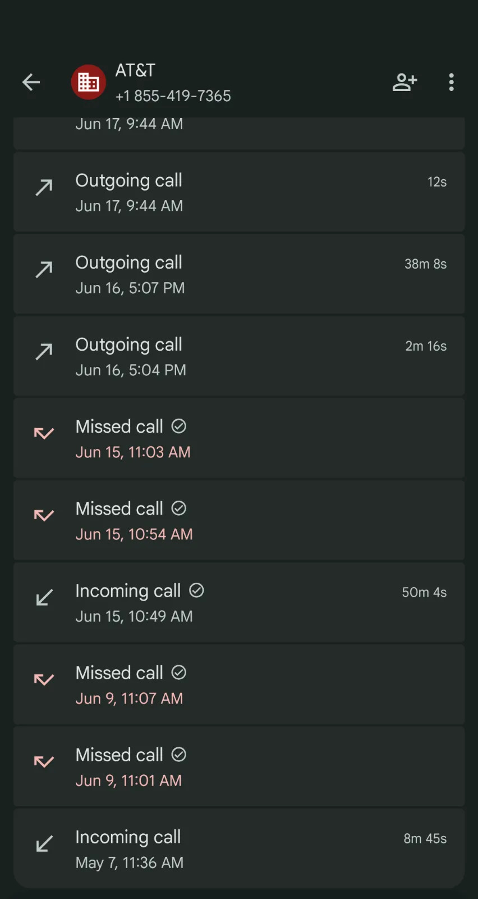

This is still a source of confusion in their billing department itself.  This included making an extension to Tuesday, June 30th -- now two (2) additional weeks (after Joshua's initial week) to allow further review -- that seemed to 'trigger' something unexpected, which prompted my wife to finally 'lose her cool.'

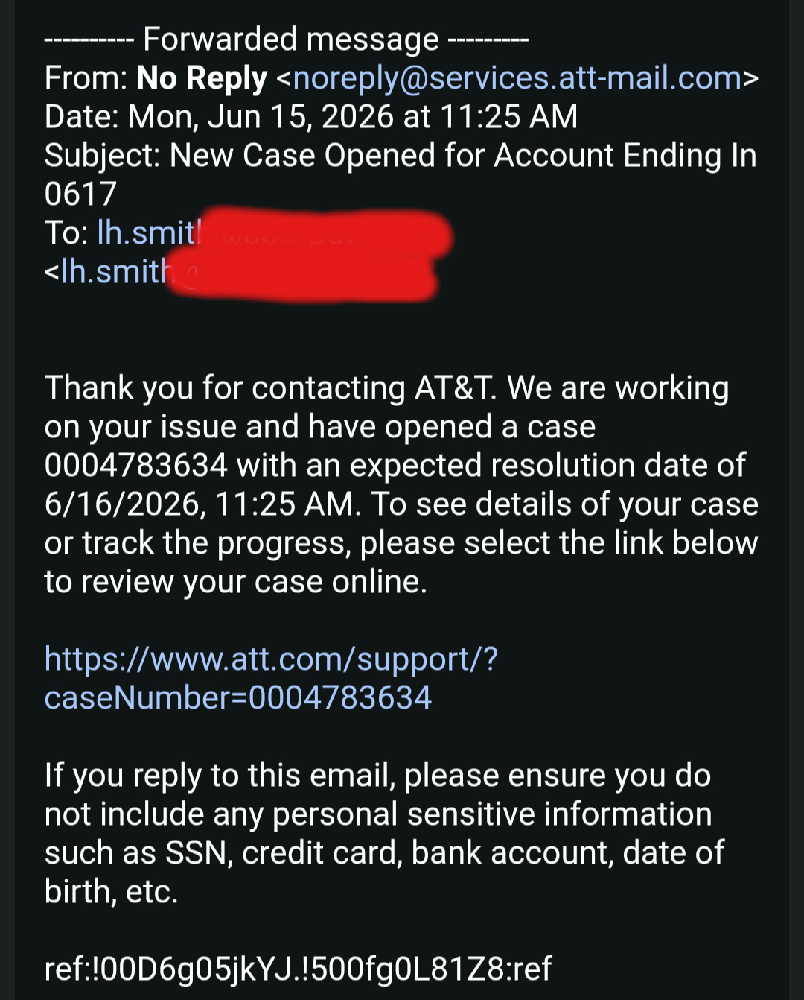 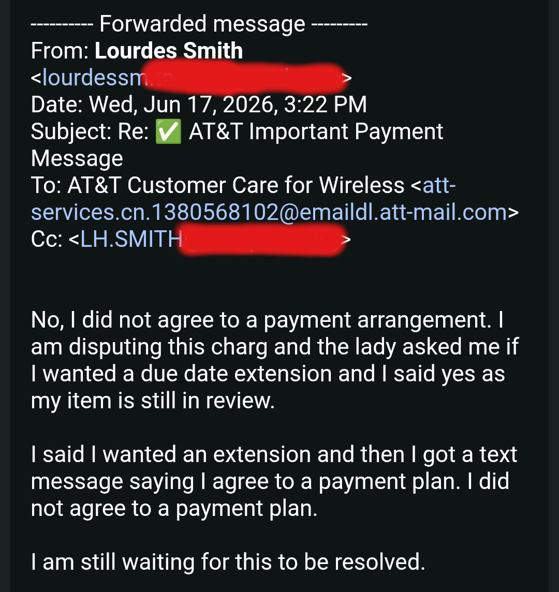

## Payment Plan Required to Extend

Apparently the second extenson prompted an 'agreement' to a 'payment plan.'  The representative (not named here) literally thought [the added] 'extension' and 'payment plan' went 'hand in hand,' but my wife was escalated to a Collections Agent named Jonathan.  He reiterated that the 'arrangement' was in-place, but this whole error on the side of the billing department would hopefully by resolved by June 30th, 2 weeks from now, and no payment plan would be required.

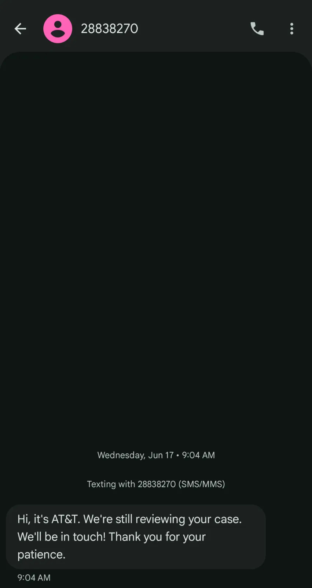 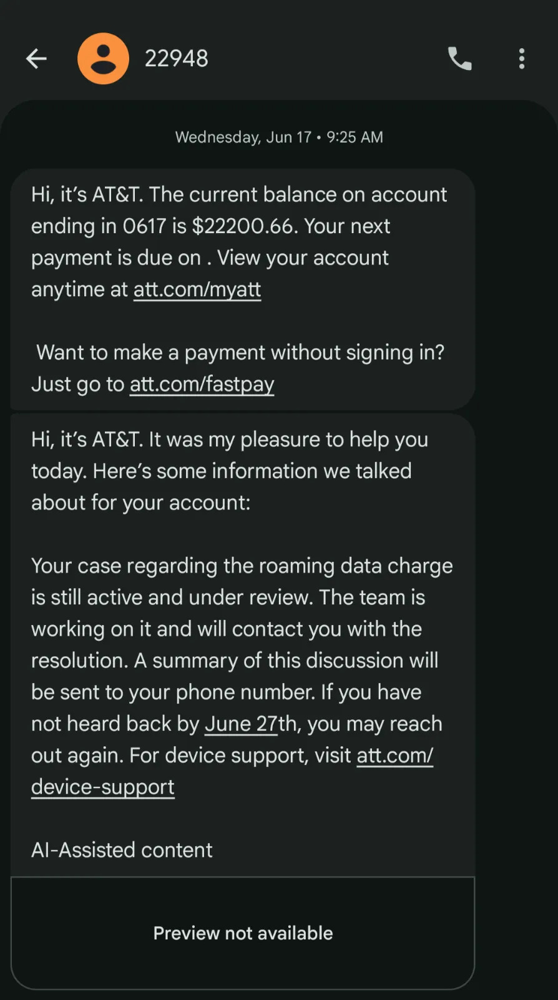 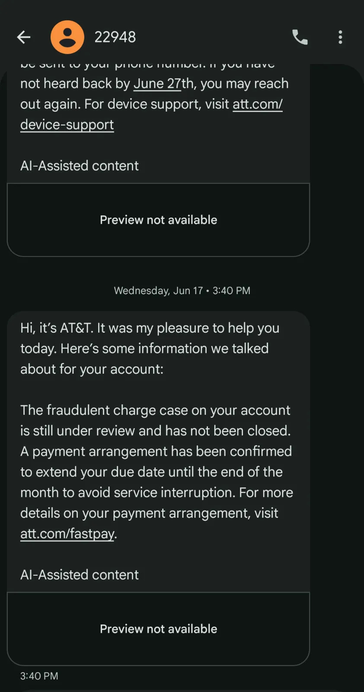 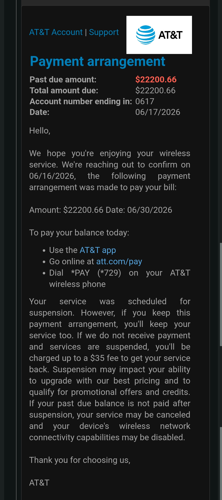

At this point, into Wednesday, May 17th, my wife's business hours were consumed by just calls to their billing department.  Case number 0004783634 had been closed, as all prior tickets, all re-asserting IDP was only enabled for Friday, May 29th, well after I was gone, and my wife as leaving.  The automated system continued to assert we were due all international roaming charges before the 29th.

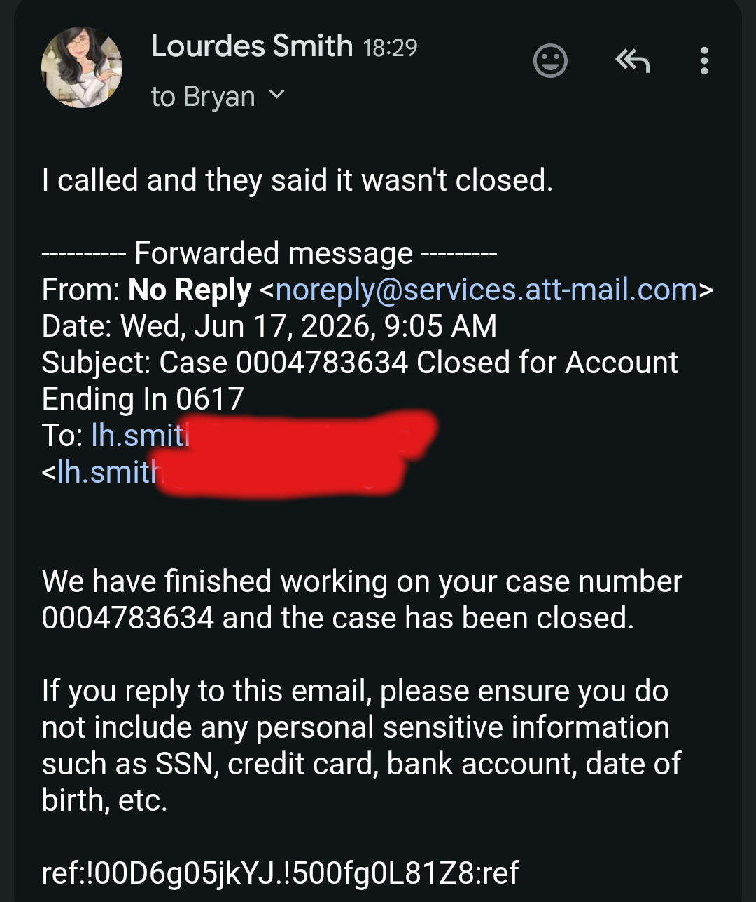

This was despite the billing department representatives saying it was still open, and the account clearly had interations on May 8th, and they could see the notes to enable for a trip starting Sunday, May 10th, and running the course of May.  The billing department had no authority to address our issue, and escalatng went no where.  No one could help us.  In fact, they were blaming automation and AI by this point, explicitly.

They were becoming equally as frustrated.

By Tuesday, May 23rd, most of our outstanding transactions from our bank account had cleared, so we closed the account, and opened a new one.  After losing some bids, and running into another problem (seller did not legally have the right to sell the house), we were looking at a few more.  We had to get re-approved any wya.  Gerardo took care of us once more at the branch near my work.

There would be a few fees due to a few things that still came in, but they were well worth it.  Same with surcharges for credit cards in payments, not worth using any debit to any account, no matter what the discount.

## Tack on Another $10K, Late Fees:  $32,408.31

Despite the extensions, AT&T was charging us late fees.  They also tacked on another $9,922.62 in roaming charges, bringing it now to $32,408.31 in total due by Friday, June 26th.  Luckily I had already exhausted my hours for the period at work, so I was not going that Friday.  I purposely did not plan anything in case I needed to get on a call.

I was eventually escalated to Rey (ID 653351), yet another supervisor with the billing department, and as he told me, the highest authority he was allowed me to speak to.  I told him from the start I was not getting off the phone until this was resolved, but I was as professional as I could be.  I had already consulted my work benefit of legal counsel, and had lined up 3 legal firms.  I was trying to avoid this 'out of pocket' (only the first 30 minutes are covered), and I was aware of the FCC and Arbitration rules, having to exhaust everything.

But I was growing tired of our $22,000, now $32,000, in interntional roaming charges being treated like a $200 problem, missing a pair of digits.  I did not raise my voice until later.

As before Rey confirmed the May 8th call, the periods it should have been active, from May 11th on-ward, which seemingly was for their carrier services, but not billing.  Billing still only had it for the day it was, for my wife only, on Friday, May 29th, as I had returned on the 26th.  

I didn't get a Ticket or Case number, only an Interaction number 043812882.

Rey aid he could not receive screenshots, and that I would have to open a ticket with [AT&T Mobility Fraud](https://attfraud.custhelp.com/app/mobility/home) to do so.  As I opened the ticket with fraud, I informed him the forms to fraud did not allow me to attach screenshots.  AT&T Global Fraud Reference number 260626-000210 was opened by myself while on the line, as I noted the number when I receive an e-mail verification.  Rey said they would contact me to receive screenshots.

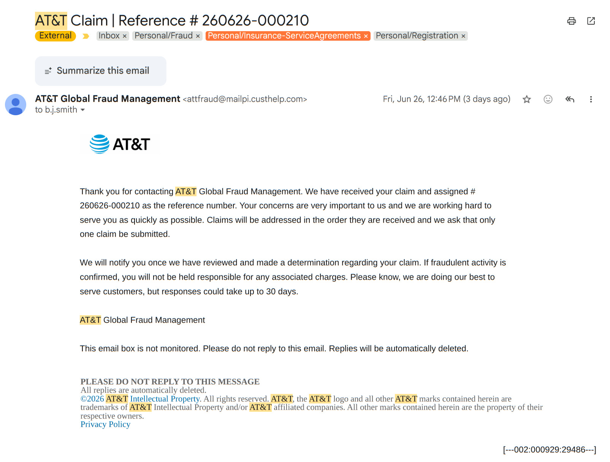

Rey went over the facts again, completed his ticket, agrees they should be voided, but that IDP was only enabled for Fri 5/29 on my billing account.  I then repeated how we are not responsible for their system's issues, or their processes not working.  Once again I press to be transferred, he said he cannot transfer me to anywhere except the customer loyalty department.

I repeat I need to talk to someone with any authority, repeat requests for stateside support, and he re-iterates they have the same procedures in the US, and nothing would be different.  I told him I would have to seek legal council at this point, and admitted said he can only transfer me to their Global Legal Team if I had a lawyer on the phone with me.

And that's when I raised my voice, and I said, "Oh, I can get a lawyer on the phone!"  I immediately said I was being 'rude,' and repeated that statement, bringing my voice down, and he was considerate.  He was, after all, in the same 'trap' as I was.  I hda 3 lawyers listed I could contact as I had previously looked up, but they were all phone numbers, no on-line interations.  I finally ask to be transfered to the Loyalty Department.

Raven (based in Illinois) in the Loyalty Department could not give me her ID.  She did not have extension.  Although we were disconnected as my AT&T SIMs always seem to disconnect me after 2 hours on a call (always been that way), she escalated and a manager has submitted a credit that should be put in by that day, Friday the 26th, and post Monday the 29th, or Tuesday the 30th, before the bill is past due.

## Never Contacted by Fraud:  Case Closed (Surprise)

The very next day, I received an e-mail that AT&T Global Fraud case 260626-000210 was closed.

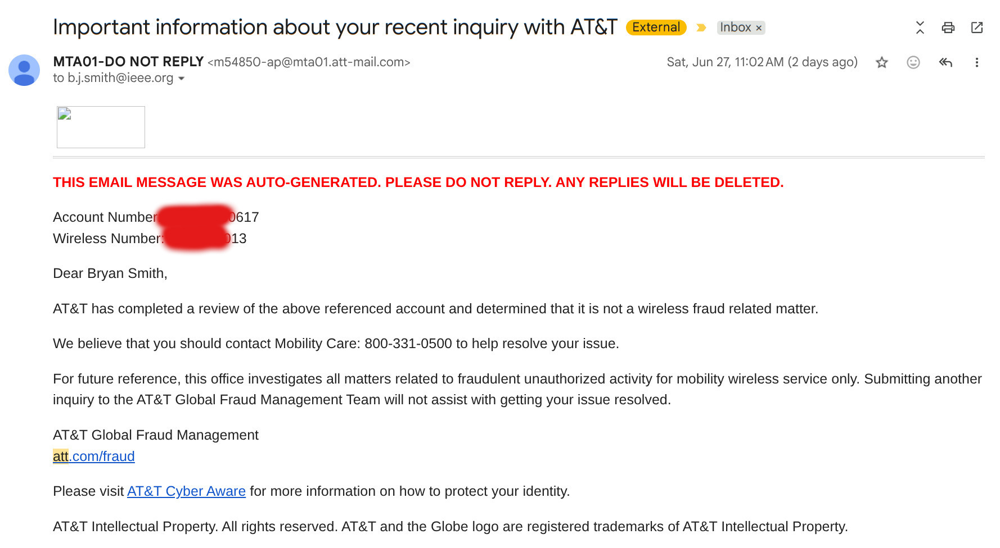

No follow-up regarding screenshots I mentioned in my submission when I opened the ticket.  No interactions at all.  No calls.  No follow-ups.  I did my best to check my SPAM filters too, but both the opening and closing notifications had no problem coming through my Google Worksplace Busness Standard account (I maintain my own domain, even though it's just myself).

A few hours later, my wife informs me about the $9,922.62 'one time credit' to our account, bringing it back down to $22,485.69, back to $22,200.66 due immediately, and would be drawn from our (now closed) bank account.

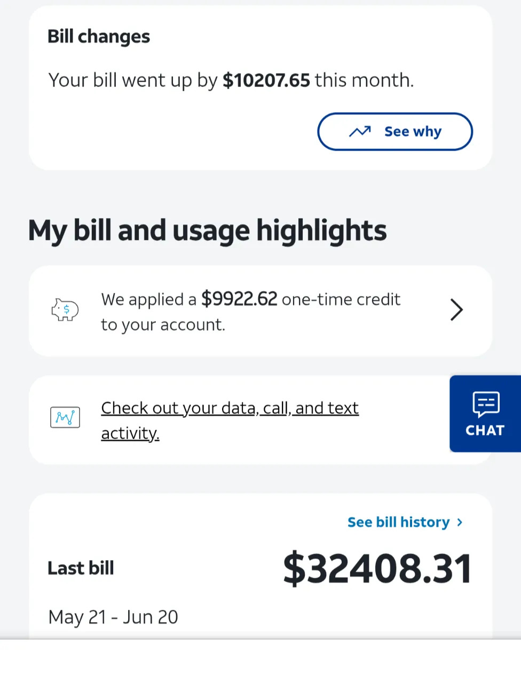 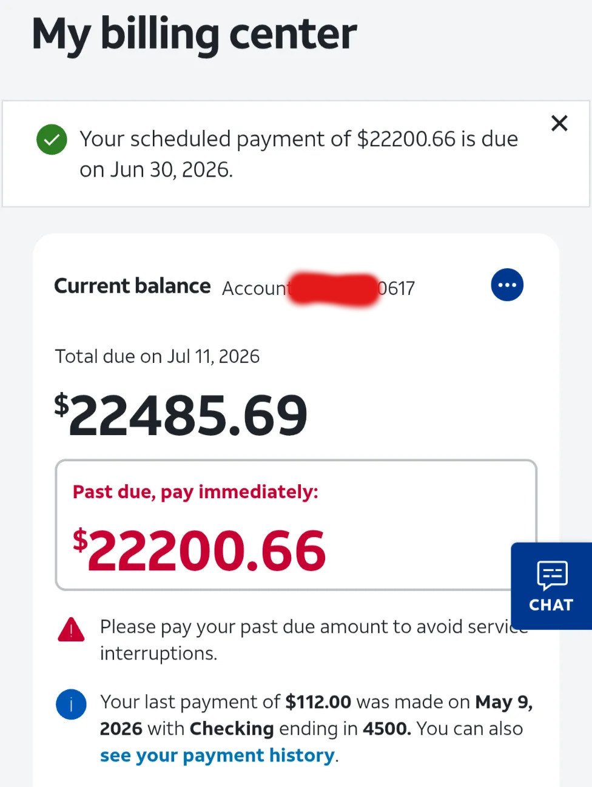

At this point, I add up even the late fees, and other aspects, and then add $180 times 2 to pay for 2 months of IDP, and just send in $600 in an one-time payment, since we still cannot change our payment method.

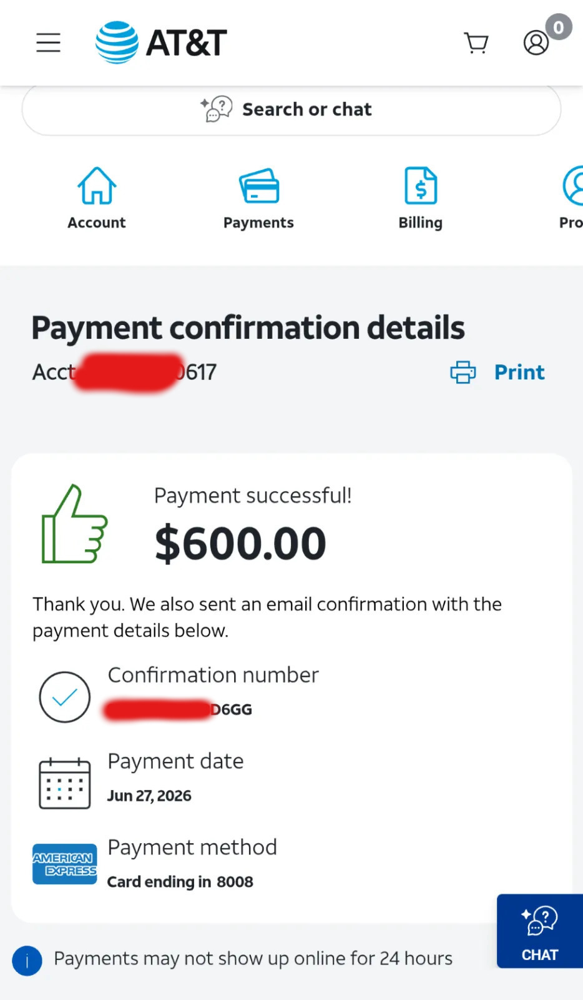

That's all we could do at this point.

## Preparing to Lose Connectivity, After 25 Years

And this is where we are today, Monday, June 29th.  We await Tuesday, June 30th, and to see if our SIM cards are disabled, possibly our IMEI identifications for our phone hardware to be reported to the FCC.  While we shouldn't see the latter, since we bought all four (4) of our current phones from Moto's US sales site directly, all 2026 and 2024 models, it wouldn't shock me if they were either.

After all, the billing department and its automation (AI) doesn't seem to speak to the carrier services department.  I've heard of worse.

In any case of any deactivation, I am talking to a lawyer, and filling out the arbitration forms, as well as escalating with the FCC, even though it hasn't been 30 days.  It's been a week shy of it, and we're without our numbers we've had for the past quarter century.  I will just go get some prepaid SIMs from my old carrier, or one of their partners, and go from there.  Assuming, of course, I don't have to buy new phones as AT&T has had all four (4) of our IMEI phones disabled by the FCC.

I'm not a lawyer, but I do understand breaches of contract, negligence, repeat, willful negligence, and resulting damages.  It's up for arbitration to say what this is, hence ... this is my last, desperate attempt.

After all, it's not $200, but $22,000 dollars (and was $32,000 at one point).  Ironically, I've done some automation for AT&T with Red Hat, as well as subbed to HP as well, and even while at HP directly to AT&T.  I won't go into what I've seen over the decades, but ... automation and AI is clearly in a bad spot, and no one at AT&T seems capable of helping us.

If you've read to the end, thank you.  If AT&T should resolve this issue, I will remove this article.  But for now, it's my documentation.  Although if GitHub and others get a DCMA takedown notice ... I'll just laugh, like I have, throughout this, after so many calls, so many dozens of hours, and so many compounding issues.

